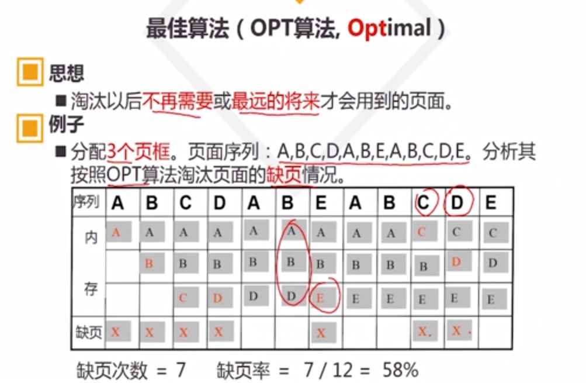
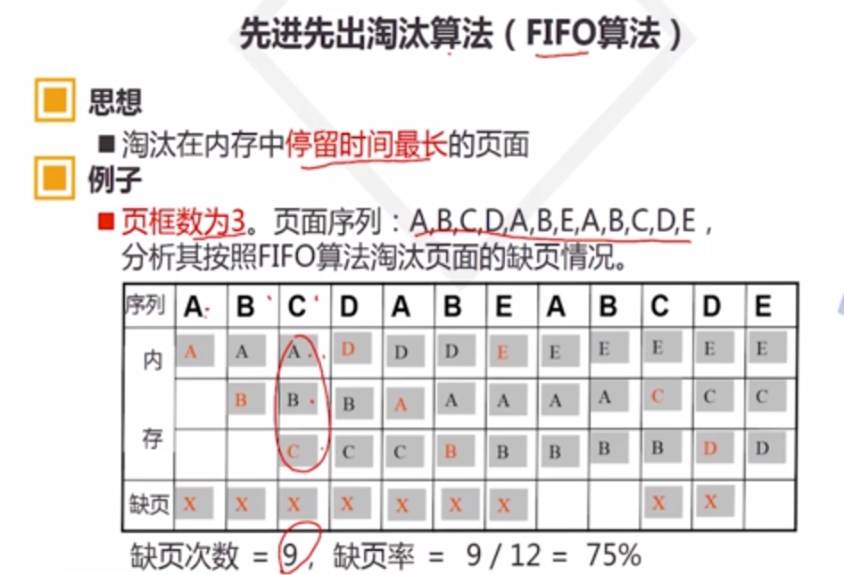
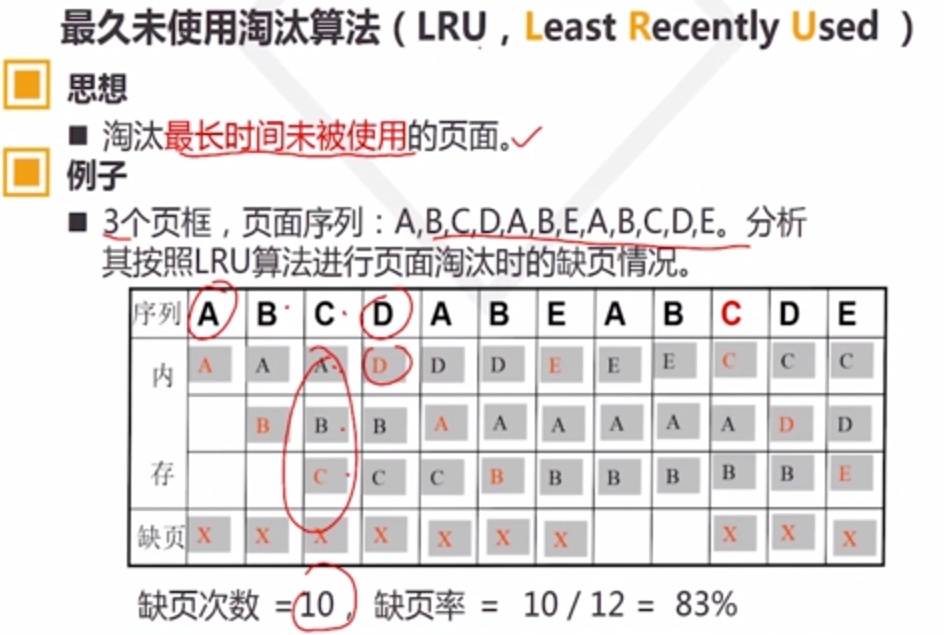
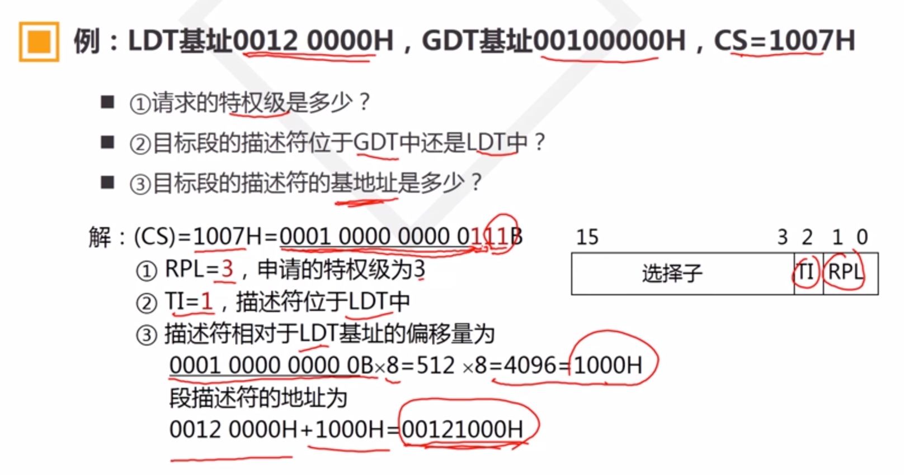
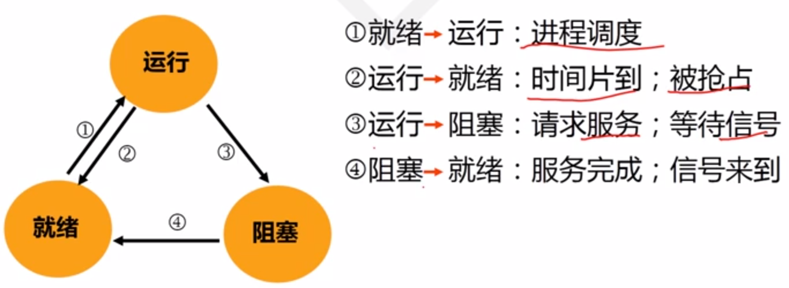
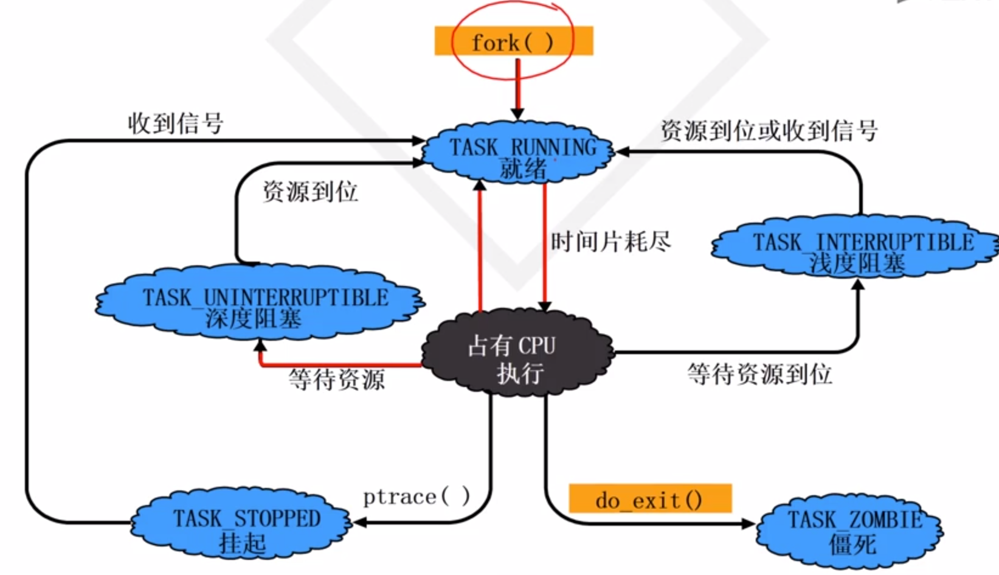
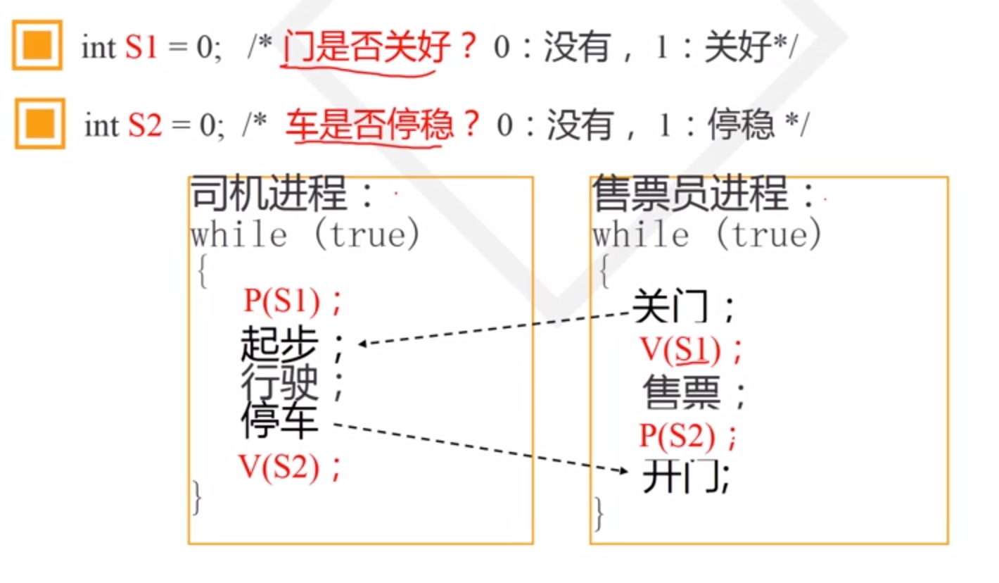

### CPU的态(Mode)
* CPU的工作状态
* 对资源和指令使用权限的描述

核态(Kernel Mode):权限值为3
用户态(User mod)：权限值为0

硬件按照态，OS按照进程

### 中断

### 实模式(Real Mode)和保护模式(Protect Mode)

#### 系统BIOS(Basic I/O System)
* 基本输入输出系统
* 位置:F0000-FFFFF
* 功能：
  * 系统启动配置
  * 基本的设备IO服务
  * 系统的加点自检和启动

#### 主启动记录MBR
* 存放在首扇区
* 存放和OS启动的相关信息
* 521BYTES
* 结束 0xAA55H

分区启动扇区(Partition Boot Sector)：BootLoader PBR

POST(加电自检)->CMOS->MBR->PBR

### 死锁
#### 起因
1. 资源有限
2. 并发进程推进顺序不当

#### 条件
1. 互斥条件
2. 不剥夺条件
3. 部分分配条件
4. 环路条件

## 进程的调度算法
* 先来先服务调度(First Come First Server):不利于短作业
* 短作业优先调度(Short Job First):忽视作业的等待时间，饥饿现象
* 响应比高者优先调度算法:(等待时间+运行时间)/运行时间，有利于短作业，有利于等候长作业
* 优先数调度算法:静态优先数和动态优先数
* 循环轮转调度法(Round-Robin):先进先出队列，新进程加到队列末尾，按照时间片q为单位轮转调度，q太大会退化为FCFS

## Linux进程调度
* 普通进程：动态优先级调度，按照调度策略来改变
* 实时进程：静态优先级
  * SCHED_FIFO:先进先出
  * SCHED_RR:时间片轮转

__子进程新建时的counter是父进程的一半__

## 进程的切换
1. 正在运行用户态进程A
2. 发生中断
   1. 保存Current当前进程的cs:eip/esp/eflags到内核堆栈
   2. 从内核堆栈装入ISR中断服务例程的cs:eip和ss:esp
3. SAVE_ALL
4. 中断处理过程中或中断返回前调用schedule(),switch_to做了进程上下文切换
5. 运行用户态进程B
6. Restore__ALL
7. iret
8. 继续运行用户态进程B

## 存储管理的功能：地址映射
1. 固定地址映射
2. 静态地址映射:程序占用连续内存空间
   1. 逻辑地址(VA, Virtual Addr)
   2. 装入地址(BA, Base Addr)
   3. 物理地址(MA, Memory Addr)
   4. MA=BA+VA
3. 动态地址映射：执行过程中把逻辑地址转换为物理地址
   1. MA=BA+VA 自动计算MA
   2. 需要内存管理(MMU)支持

## 存储管理功能：虚拟存储
* 封闭空间
* 物理地址分离

## 存储管理功能：内存分配功能
## 存储管理功能：存储保护功能

## 空闲区表排序策略
* 首次适应法：按照首地址递增排序，尽可能使用低地址
* 最佳适应法：按大小递增排序，尽可能使用较小空闲分区(最容易产生碎片)
* 最坏适应法：按照大小递减，仅需查找一次

## 分区回收：释放区更新大小位置插入等

## 覆盖(Overlay)：常驻区和覆盖区
* 通过程序的模块设计可以适应覆盖技术
* 编程复杂
* 程序执行时间长

## 交换(Swapping):内存不够时将进程写道磁盘，当进程要运行时重新写回内存

## 内存碎片-类似于Stop the world
* 规定门限值
* 内存拼接技术
* 解除程序需要占用连续内存

# 虚拟内存管理
## 页式虚拟存储管理
* 把进程空间和内存空间分为等大小的页框
* 进程以页为单位装入内存
* 内存以页框为单位分配使用

## 页表和页式地址映射
虚拟地址VA可以分为页号P和业内偏移W
P=VA>>n
W=VA&&(2^n-1)
### 页面映射表
页号-页框号-其他特性
### 页式地址映射
虚拟地址->物理地址
1. 从VA分离页号P和W
2. 查页表，以P为索引查页框号P'
3. 计算物理地址MA=P'<<n+W
> Move R1,[2500]
> 
> P=2500>>10=2 
> 
> W=2500&&(1024-1)=452
> 
> 查页表P=2 P'=7
> 
> MA=7<<10+452=7620

## 块表(Cache)

## 缺页中断
* 缺页率

## 页面淘汰策略：缺页率低，页面抖动小
### 页面抖动：内存和辅存的频繁交换
* 最佳算法(OPT,Optimal):淘汰以后不再需要或最远的将来才会用到的页面

* 先进先出淘汰算法(FIFO算法)

* 最久未使用淘汰算法(LRU, Least Recently Used):淘汰最长时间未被使用的页面

* 最不经常使用算法(LFU)

## 缺页因素分析

## x86CPU架构下三种地址
1. 逻辑地址
2. 线性地址：由逻辑地址转换得到
3. 物理地址

(逻辑地址）-段机制-(线性地址)-分页机制-(物理地址)

### 段和段描述符(Descriptor，8字节)
数据段，代码段

描述符表
* 全局描述符表(GDT):TI=0
* 局部描述符表(LDT):TI=1
* 中断描述符表(IDT)

选择子(Selector)

## SPOOLing
* 任务执行前：预先将程序和数据输入到输入井中
* 任务执行时：使用数据时，从输入井中取出
* 任务执行时：输出数据时，把数据写入输出井
* 任务运行完：外设空闲时输出全部数据和信息

# 进程
### 进程的定义
* 进程是程序在某个数据集合上的一次运行活动
* 数据集合：软硬件环境，多个进程共存共享的环境
### 进程的特征
* 动态性
  * 进程是程序的一次执行过程，动态产生和消亡
* 并发性
  * 进程和其他进程一起向前推进
* 异步性：进程按各自的速度向前推进
* 独立性：进程是系统分配资源和调度CPU的单位
### 进程的类型
* 系统进程
* 用户进程
### 进程的状态
* 运行态(Running)
* 就绪状态(Ready)
* 阻塞状态(Block)

Linux
* 可运行态
* 阻塞态
  * 深度阻塞：请求IO等其他服务
  * 浅度阻塞
* 僵死态:TASK_ZOMBIE
* 挂起态:TASK_STOPPED

### 进程控制块(Process Control Block, PCB)
## 进程控制:在进程的生存全期间，对其全部行为的控制
* 创建
* 撤销
  * 递归撤销，先撤销子进程
* 阻塞
* 唤醒

## 进程的同步与互斥
* 同步：先后关系或需要满足前提条件

## P-V操作
* P操作可能使自己阻塞
* V操作可能会唤醒阻塞的进程(会向前运行，但是可能会唤醒其他阻塞的进程)

### P-V操作解决互斥问题
* 进入临界区前进行P操作
* 离开临界区之后进行V操作

### P-V操作解决同步问题
* 条件不满足暂停进程：P操作
* 条件满足唤醒进程：V操作

